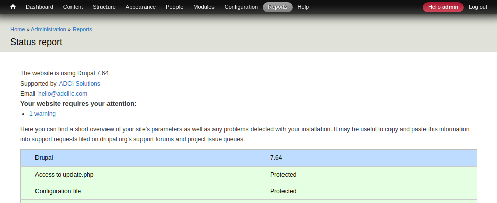

INTRODUCTION
------------

The "ADCI Solutions contact information" module implements ADCI Solutions contact information block for users with
"Administer site configuration" permission.

REQUIREMENTS
------------

This module requires no modules outside of Drupal core.

INSTALLATION
------------
 * Download the module's 7.x branch code from the repo and extract to a website's `sites/all/modules/custom` directory.

 * Rename the module's directory to `adci_contact_info`.

 * Install as you would normally install a contributed Drupal module. Visit
   https://www.drupal.org/node/895232/ for further information.

CONFIGURATION
-------------

 * Navigate to the `/admin/structure/block` page, select used administration theme in the tabs navigation and place the
   "ADCI Solutions contact information" block to the "Help" region as a first block or any other region that fits best.

 * Verify that block looks well in the used administration theme.

